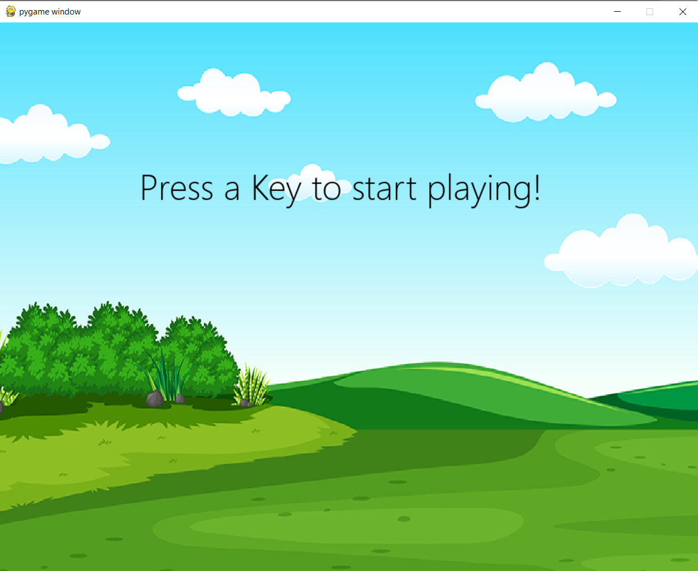
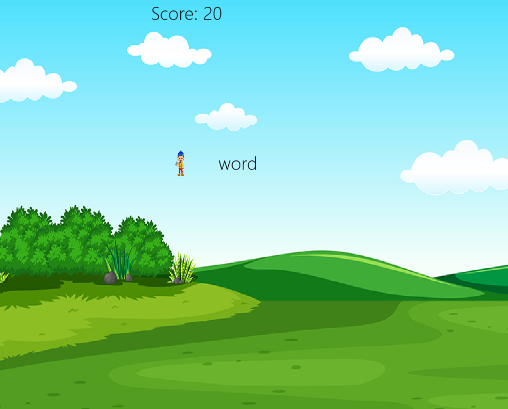
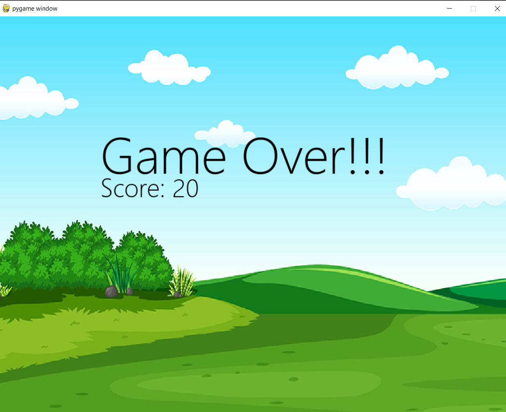

# Keyboard-Jump-Game---PyGame
A fun game that helps in increasing the typing speed of the player. In this game, random words are displayed and the player has to type the word correctly before the word disappears and if the word is misspelled the player loses the game, otherwise the score is incremented.
# Screenshots of the game
&emsp;&emsp;&emsp;&emsp;&emsp;&emsp;&emsp;&emsp;&emsp;&emsp;&emsp;&emsp;&emsp;&emsp; 
&emsp;&emsp;&emsp;&emsp;&emsp;&emsp;&emsp;&emsp;&emsp;&emsp;&emsp;&emsp;&emsp;&emsp; 
&emsp;&emsp;&emsp;&emsp;&emsp;&emsp;&emsp;&emsp;&emsp;&emsp;&emsp;&emsp;&emsp;&emsp;
